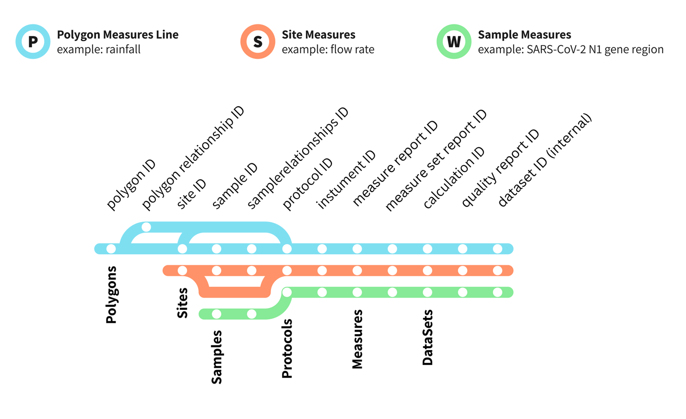
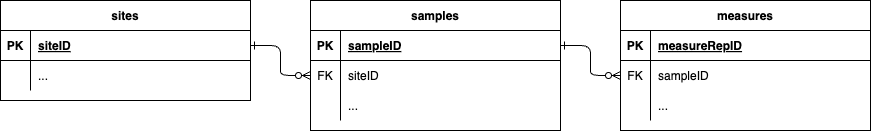
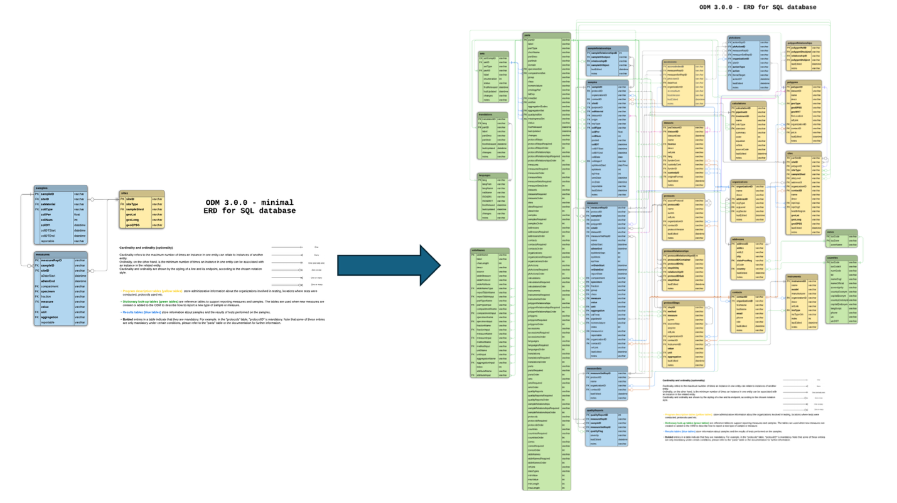
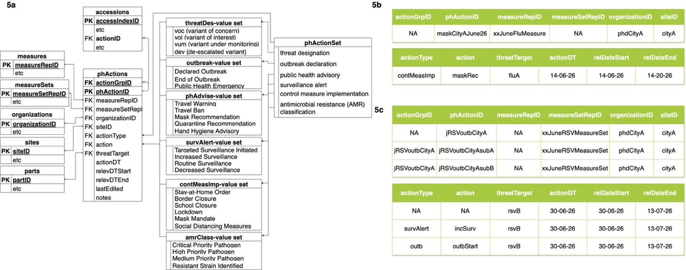
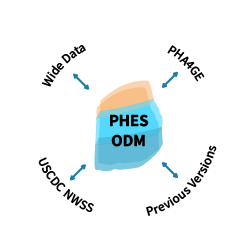
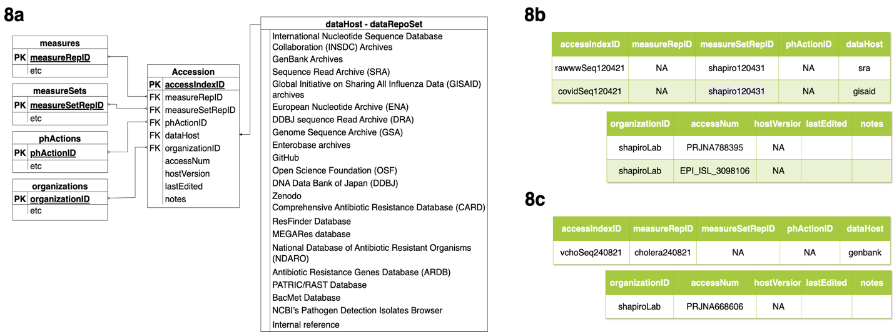
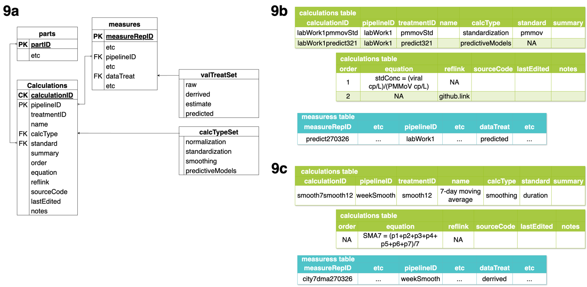
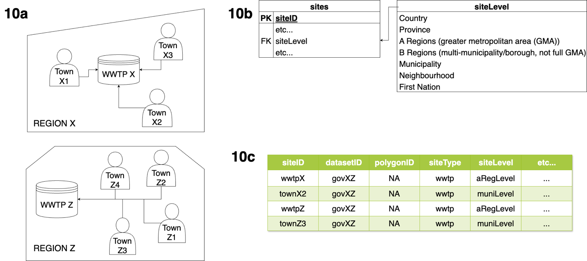
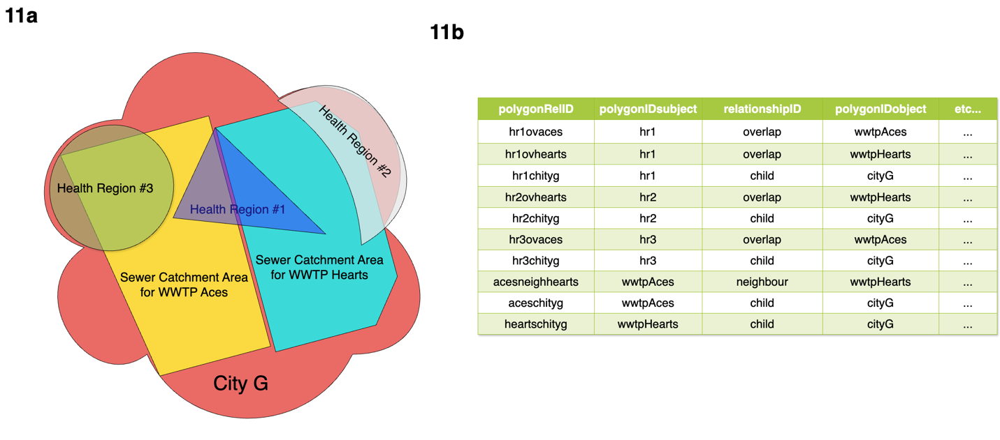

# 1. Introduction

Historically used to track fecal-transmitted and water-borne pathogens, wastewater surveillance (WWS) of public health threats has become increasingly discussed since the emergence of SARS-CoV-2 and the COVID-19 pandemic [1-2]. Since that time almost 300 universities, with over 4,500 sites in over 70 countries, implemented WWS programs [3-4]. The World Health Organization, among other experts, have lauded the rapid development and adoption of WWS as a valuable addition to the existing pathogen surveillance programs, and celebrated its utility as a valuable tool for promoting and protecting human health [5-6]. As a part of the boom in WWS, the Rockefeller foundation convened the Wastewater Action Group [7], and the Bill and Melinda Gates Foundation has made WWS part of its Enterics, Diagnostics, Genomics & Epidemiology (EDGE) program [8]. Voluntary and global networks-of-networks, such as GLOWACON [9], have also been assembled, with an aim to establish global networks, and networks of networks, to support WWS. These networks have succeeded in convening and supporting the community of practice and have fostered knowledge-sharing and the deployment of innovations for informed public health decision-making [9]. 

The rise of WWS, however, is not without challenges [7, 10]. In particular, data from WWS is not made widely accessible, and this restricted access to data hampers large-scale coordination and meta-analytical research, ultimately obstructing the integration of wastewater insights into actionable public health policy. Challenges have been persistent since the inception of many programs [3-4]. As such, addressing barriers and improving support for open data sharing is a priority issue for global networks. Networks have begun to collaboratively generate and release guidance documents on how to communicate wastewater-related public health findings, as well as best practices on how to perform the analyses required. Networks are also discussing standardization, best practices in statistical modeling, and feasibility studies on open-sharing platforms [7-9]. For new surveillance systems like WWS, the absence of (or unwillingness to adopt) existing data standards, insufficient system literacy, lack of guidance on the interpretation of data, insufficient data infrastructure, poorly understood or explained laboratory infrastructure, and the diversity of fields involved in WWS in particular, all pose important challenges to the longevity and utility of these programs, as well as to data sharing and coordination [11]. Furthermore, issues around consistent data reporting, the lack of interoperable data formatting, inconsistent metadata collection, and reticence toward data sharing all need to be addressed if WWS is to advance and become a permanent fixture of the public health landscape [11-12].

The Public Health and Environmental Surveillance Open Data Model (PHES-ODM) was developed during the inception of WWS for SARS-CoV-2 in Ottawa, Canada, to standardise data reporting and storage [13-14]. By structuring real-world entities and recording critical metadata---such as collection methods and analytic protocols---the model provided valuable context as diverse labs began reporting to the Ontario provincial government. From the first prototypes, this metadata was instrumental in distinguishing true infection trends from site-specific technical variations. Originally developed in collaboration with the Delatolla lab (Ottawa) and the CentrEAU research cluster (the province of Québec), the PHES-ODM filled a void where no national or international standards yet existed. The remarkable success and impact of open data sharing from COVID-19 clinical surveillance systems [15] and growing interest in PHES-ODM led to the adoption of a fully open and collaborative platform. Major contributing organizations included the European Commission Joint Research Centre, the United States Centers for Disease Control and Prevention’s (USCDC) National Wastewater Surveillance System (NWSS)[16], and the Public Health Agency of Canada [17], along with Canadian provincial WWS programs in Ontario and Québec. The model was also adapted by organizations in the private sector, notably the CETo epidemiological software program [18] and AdvanSentinel’s program [19]. Collaboration and participation continued to expand with regular working group meetings, and membership from all world regions except Africa. 

The PHES-ODM was designed as an open, collaborative data standard to provide a common language when discussing WWS globally. It emerged to fill the need for a standard or openly available structure for recording and storing WWS data. This was an issue to be solved because transparency in maintaining data is foundational to its ethical handling [20], and transparency and metadata are crucial to principles of data justice. According to D’Ignazio and Klein [21], “consider context” is the sixth principle of data feminism; without context---provided through metadata---data remains prone to misinterpretation. When this data is about humans and human health, misinterpretation can cause immense harm. Data is also only useful if it is understandable and analyzable---without access and context, there is no possibility to repurpose the data. Governments also risk squandering public funds and eroding public trust if collected data cannot be used. To better define guidelines to assess data transparency and usability, the FAIR Data Principles assert that responsible and ethically managed data should be Findable, Accessible, Interoperable, and Reusable [12]. In line with these principles, we developed open data dictionary to support metadata management. Data dictionaries, resources that support data curation by providing standardised definitions of terms for use in metadata, are foundational to transparent data collection and management. They also facilitate ethical handling of sensitive data, and support transparency in research and data inquiry through the entire lifecycle of the data [20]. These kinds of good data management and stewardship protocols are prerequisites to advancement and innovation in any field, but particularly in developing fields such as WWS and wastewater-based epidemiology (WBE) where sharing and collaboration between areas of practice and institutions are essential. 

In its approach to WWS data, the PHES-ODM aims to emulate and adapt approaches from similar systems within public health, like Logical Observation Identifiers Names and Codes (LOINC), a universal standard and database for medical laboratory measures [22]. In this way, version 1 of the PHES-ODM enabled users to record the basic WWS data and metadata in a standardised way, facilitating the exchange and aggregation of these data to improve coordinated surveillance efforts [13]. Beyond technical utility, the model was meant to improve public health outcomes by enhancing wastewater and environmental surveillance and epidemiology through interoperable, transparent, and efficient data collection and use. By using a relational database structure, the model links data across the entire analytic lifecycle. With unique identifiers for sites, samples, measures, and other attributes, the relational structure allows for each piece of the WWS process to be recorded and accounted for, while avoiding issues like data duplication, inconsistency, and challenges with insertion and deletion [14, 23]. Version 1 focused on recording sample information and measures, site information and measures, and clinical surveillance information on COVID-19 infections. With version 2 of the PHES-ODM, the model collapsed site and sample measures into a singular measures table, while expanding out additional provisions for methods, protocols, sample provenance, among many other fields [14]. While the original version 1 [13] could still be effective for small-scale SARS-CoV-2 surveillance programs, version 2 went much deeper to collect information and respond to growing demands for additional metadata fields. It also provided templates for reporting variants and mutations of SARS-CoV-2, and the tracking and reporting of additional pathogens. The structure of version 2 further built on the original relational format and expanded linkages using keys. By integrating this relational approach with entity-relationship modelling frameworks [24], the PHES-ODM provides a robust and highly customizable database structure that ensures data provenance is explicit in the metadata.

While the adoption and use of both version 1 and 2 of the model have been very successful, global progress on WWS programs is now at risk. As political priorities shift toward managing polycrises [25] and an endemic approach to SARS-CoV-2, there is a danger of losing the momentum gained in global wastewater surveillance [6]. A concerted effort to continue to support and develop WWS programs and initiatives is required to maintain this system for the next pandemic. Initiatives to assess programs are forthcoming [26], but data models need to be responsive to additional context and expanding programs. After the release and wide global adoption of version 2 of the PHES-ODM [14], it is now the official model used by the Public Health Agency of Canada for their WWS program [17] and has been adopted and modified by the European Union Sewage Sentinel System for SARS-CoV-2 [27], among other programs and initiatives. WWS data is still, however, heavily siloed and in a crisis of a lack of interoperability and sharing. 

Building on the foundation of version 2, this paper introduces version 3 of the PHES-ODM. The revisions and expansions in this latest iteration were developed in direct response to consultations with current users and data dictionary developers. We explore the model’s evolution, focusing on its ability to balance robust functionality with ease of use while supporting interoperability within complex epidemiological environments. Ultimately, Version 3 offers structural solutions to common data challenges in WWS; this paper details the model’s architecture, its target audience, implementation, and overall utility for global WWS programs and as a solution to data challenges in the larger field of WWS.

# 2. Materials and Methods

## 2.1. Overview of the PHES-ODM: the structure of the model

A more detailed account of the underlying basic structure from version 2 of the PHES-ODM, and the rationale that led to this structure, has been described elsewhere [14]. To review the general principles, however, we need to acknowledge that wastewater and environmental surveillance data are complex and that many factors, originating from vastly different disciplines, must be considered when interpreting them. Information about the geographic area, its population and composition; environmental and industrial factors in and around the sampling site; sample composition and treatment details; information on the methodology and analytical assays employed; as well as data on measurement and sample quality, are all crucial to interpreting WWS data.

{#fig-1}

Beyond just site and sample information, the PHES-ODM allows for the recording of more expansive geographic data, such as polygon information, which distinguishes it from most other WWS data standards. In geospatial terms, a polygon is a closed shape specified by a sequence of unique coordinate pairs where the first and last pair are the same [28]. Within the context of WWS these polygons represent defined areas such as municipal boundaries, wastewater treatment plant catchment areas, or health administrative regions. By recording these geographical descriptors and their nested sites, the model ensures interoperability with Geographic Information Systems (GIS). This hierarchy allows for data storage across multiple scales:

- Polygons: viral wastewater measures within a broad catchment area.
- Sites: technical data, such as flow rate in a wastewater treatment plant.
- Samples: a discrete sample of water or wastewater, collected at a point or time period, including how it was collected, transported, and stored. 
- Measures: include any measurement from a site or sample. The key measure is typically a PCR or genomic sequence of an organism. However, measures can include contexts such as temperature, inhibitors, or chemicals. 
- Populations: public health outcomes, such as hospitalization rates within a defined area. 

{#fig-2}

- The PHES-ODM is implemented as a relational database---a structured system in which data are organized into linked tables. The relational structure is vital for WWS, where data are inherently complex and interrelated. By separately tracking site, sample, population, and geographic information, the model provides a comprehensive overview of the surveillance landscape while eliminating the onerous data entry required for repeated items. In this framework, real-world concepts are represented as “entities” (e.g., a sample or a site), while their specific characteristics are recorded as “attributes” (e.g., collection date or building type). In practice, each entity is represented by a table, where attributes serve as column headers. The relationships between these tables are managed through unique identifiers, or keys [23-24]. Each table in the PHES-ODM has a primary key (PK), which uniquely identifies each row in that table. When PKs are referenced in another table, to which they are not the primary key, they are termed foreign keys (FKs). For example, the “sites” table records all information about sampling sites, with “siteID” as its PK. When a sample is collected at a site, “siteID” appears in the “samples” table as an FK - linking location data to sample records without duplicating site information. This pattern repeats: “sampleID” serves as an FK in the “measures” table, chaining sites to samples to measures. For an illustration of this structure, see Figure 3. 

{#fig-3}

Separating entities also enables customizability. WWS programs differ in scale, capacity, and approach; prescribing a single rigid structure would force local modifications that undermine interoperability. To address this, the PHES-ODM offers a minimal version containing only mandatory data and metadata fields, while the full model includes provisions for any additional items that larger programs may wish to record. Figure 4 compares the entity relationship diagrams for the minimal structure (left) and the full version with all optional fields and reference tables (right).

{#fig-4}

## 2.2. Audience and aims for WWS data

WWS programs are, by their very nature, complex -- they require collaboration between engineers, biotechnologists, policymakers, and public health professionals. The programs require that all these groups be able to communicate effectively with one another. What is being communicated between these groups is often domain-specialized knowledge, making it hard to understand each other’s work or share a single database. Furthermore, different users and analysts may want different things from the data. By organizing the data around entities, we focus and streamline data entry by work domain. The model needs to include features to improve the usability of the data by various actors. 

The target audience for the PHES-ODM is thus all these groups: engineers, biotechnologists, policymakers, and public health professionals. The model also intends to serve any analysts -whether primary or secondary -- who work with WWS data. 

## 2.3. WWS data standardization and interoperability

The FAIR data principles -- Findable, Accessible, Interoperable, and Reusable [12] - are among the most widely cited frameworks for data standards and data models. Other groups have tried to expand on these principles, either by adding layers of interoperability [29], or by expanding the principles to encompass other, more human-centric criteria, such as cognitive interoperability [30].

The European Open Science Cloud (EOSC) Interoperability Framework [29] specifically posits interoperability as having four layers, specifically: **Technical interoperability**, meaning that Information Technology (IT) systems have completely understood interfaces and are able to work with other IT systems without restrictions; **Semantic interoperability**, which ensures that the format and meaning of data is preserved and understood throughout exchanges between parties; **Organisational interoperability**, meaning organisations align their business processes and responsibilities to achieve shared goals; and **Legal interoperability**, which ensures that organisations can work together even if operating under different legal frameworks. Vogt’s additional data principles centre largely around ensuring data are *cognitively interoperable*. That is, data must be understandable and usable by humans, not only machines [30].

Researchers examining secondary use of population data - the situation facing most WWS analysts who are not the primary data generators - highlight the importance of robust metadata that makes clear the scope, limitations, and transformations already applied to the data, alongside a comprehensive data dictionary that defines variables and supports validity assessment [31]. Data standards, and the data dictionaries that define them, improve interoperability by enabling users to structure data and metadata in technically and semantically consistent ways. Yet the development of standards is not without problems. Some are proprietary, limiting adoption. Even among open standards, overlapping items are not always interoperable - open standards may be necessary for health data interoperability, but they are not sufficient on their own [32]. Across domains, data standards fall short of their interoperability goals when they do not actively prioritise interoperability with one another [33]. The solution is not a single, universal standard, but rather several major standards that can interoperate. Building on that line of reasoning, sound structural principles make for a good data standard, but so does working with other standards in the field. The PHES-ODM seeks to apply the interoperability principles outlined above while also working with other major WWS data standards to ensure data can flow between them (an overview comparing the PHES-ODM with other major WWS data standards is provided in Table 1). Interoperability offers tangible benefits---greater data access, more usable data, improved efficiency, and enhanced collaboration [34]. In public health surveillance, these benefits translate into lives saved.

## 2.4. Structural solutions for data challenges and interoperability

Data standards and dictionaries are designed to ensure that data are generated, used, and shared without issue, but problems persist due to structural issues in the data standards, or user error in their application. Literature on issues encountered in population and public health data is strong, and the issues persist across research disciplines [31, 35-36]. Of particular concern are challenges around: ambiguous data definitions; a lack of contextual information (methods applied, standardization of data definitions, location data); lack of clarity on the temporality of the data; ambiguous data revisions, or no capacity to perform data revisions; unreported differences in the level of spatial and temporal resolution across the data; uncertain data quality; ambiguous ownership, credit, and licensing of data; and difficulty in databases and data infrastructure around balancing robustness against ease of use.

The super-issue that underlines most of these problems is one of ambiguity. With data, and secondary use of data, we do not know what we do not know. Clearly recording the maximum information is the only solution for avoiding misuse and misrepresentation of population and surveillance data. The issue exists throughout the lifecycle of the data, and if data collectors are unaware of what context is important, it will not get recorded. The PHES-ODM has thus tried to address these challenges structurally, by explicitly including provisions to counter these important ambiguities:

- Data dictionaries and ontology integration to counter ambiguous data definitions
- Protocols and calculations data tables to counter a lack of contextual information
- Data relevancy periods to clarify data temporality
- “Last edited” and “notes” fields for tracking data corrections transparently
- A “site level” and “specimen” field for tracking spatial resolution of the data
- “Reportable” and “quality flag” fields for recording measure quality issues; a validation library to improve data quality issues
- “License “fields connected to datasets and measures to ensure responsible and legal use
- Documentation and online community resources to balance ease of use against a robust model

The other barrier to interoperability through data standards is a lack of adoption. Many researchers argue for the importance of data standards and interoperable data, but few implement standards in their work. Within the GLOWACON technical working group on data, a survey of the membership indicated the majority thought interoperability and data standards were important, but almost none used a data standard themselves. This is a complex problem that is related to a myriad of factors (lack of awareness, lack of implementation tools; lack of time), and the PHES-ODM is trying to address them all through: 

- Outreach and extensive documentation
- Building tools with built-for-purpose interfaces, including data parsers and validators, and
- Ready-to-use templates for common use cases, and video documentation to support their uptake.

**Table 1: An overview of the most commonly referenced data models for wastewater and/or environmental surveillance, and a comparison between them.** This table is based on Therrien et al’s Table 1 [14] but is expanded and updated to include additional categories and reflect the current landscape of environmental public health data models.

| **Feature** | **PHES-ODM** | **NORMAN SCORE** | **W-SPHERE** | **NWSS** | **PHA4GE** | **AMELAG** | **MIxS** |
| --- | --- | --- | --- | --- | --- | --- | --- |
| **Reference** | Manuel et al, 2021 [13]; Therrien et al, 2024 [14] | NORMAN Network, 2020 [37] | Global Water Pathogens Project, 2020 [38] | USCDC, n.d. [16] | Griffiths et al, 2022 [39]; Paull et al, 2025 [40] | RKI, 2025 [41]; RKI & UBA, 2026 [42] | Genomic Standards Consortium, n.d. [43] |
| **Intended Audience** | WWS practitioners (public health authorities, Engineers in WWS) | Ecotoxicologists, SARS-CoV-2 template for WBE practitioners | WWS practitioners | WWS practitioners | Environmental Genomics | WWS practitioners | Environmental Genomics |
| **Documentation language** | Narrative documentation: English; database definitions and data dictionary: English, French, Spanish, Portuguese | English | English | English | English | German, English | English |
| **Public data dictionary of headers and tables** | Yes | No | Yes | No (outdated version available from USCDC archive) | Yes | Yes | Yes |
| **Public data dictionary of values** | Yes | No | No | No (outdated version available from USCDC archive) | Yes | No | Yes |
| **Database structure type** | Relational database | Flat-file database | Flat-file database | Flat-file database | Flat-file database | Flat-file database | Flat-file database |
| **Public database definition** | Yes | Yes | No | No | Yes | Yes | No |
| **Public data conversion tools** | Yes | No | No | No | Yes | No | No |
| **Public data validation tools** | Dictionary, software tool, templates, validation rules schema | Template | Template | None | Dictionary, software tool, templates | Dictionary, validation rules schema | Dictionary, software tool |
| **Public data sharing infrastructure** | Python library, explicit measure and dataset licensing, external dataset linkages | No | High-level dashboard | High-level dashboard | Software tool (DataHarmonizer) | Dashboard, Zenodo publication of data | Many repositories require adherence to this standard to share |
| **Public data collection templates** | Yes | Yes | Yes | No | Yes | No | No |
| **Governance and development** | Open source | Inter-institutional | Internal | Internal | Open source | Internal | Open source |
| **Model license** | CC-BY4 | Not found for the model, but the template is open access | Not found | Not found | CC-BY4 | CC-BY4 | CC-BY4 |
| **Clear channels for user feedback** | GitHub issues, Discourse discussion board, email maintainers | Email maintainers | Email maintainers | Email maintainers | GitHub issues, email maintainers | Email maintainers | GitHub issues, email maintainers |
| **Rights management** | Element-level (any row, header or combination) | Dataset level | Dataset level | Dataset level | Dataset level | Dataset level | Dataset level |
| **Environmental compartments** | Various | Various, but only wastewater in the template | Wastewater | Wastewater | Various | Wastewater | Various |
| **Pathogen measurement** | Any pathogen in the dictionary (Multiple+) | Yes, but only SARS-CoV-2 in template | SARS-CoV-2-specific | Multiple | Multiple | Multiple | Multiple |
| **Detailed protocol recording and linkage** | Yes | No | No | No | No | No | No |
| **Detailed sample relationship records** | Yes | No | No | No | No | No | No |
| **Measurement methods** | Yes | Yes, but only PCR and sequencing-specific in the template | PCR and sequencing-specific | PCR and sequencing-specific | Sequencing-specific | Not found | Sequencing-specific |
| **In-sample measurements** | Any measure in the dictionary | Water quality, but only PCR in the template | PCR and sequencing | PCR and sequencing, pH, Conductivity, TSS | PCR and sequencing, water quality | PCR and sequencing, pH, temperature | PCR and sequencing, water quality |
| **Collection site information** | Yes | Yes | Yes | Yes | Yes | Yes | WWTP infrastructure details |
| **On-site measurements** | Any measure in the dictionary (expandable) | Flow, Weather, COD, TSS, NH4+-N, Water temperature | Flow | Flow, water temperature | Flow, Weather, COD, TSS, NH4+-N, Water temperature, conductivity, pH, contamination | Flow, pH, temperature | COD, TSS, NH4+-N, phosphate, salinity, |
| **Population count** | Served by site, or within a geographic region (polygon) | Served by site | Served by site | Served by site | Served by site | Served by site | No |
| **Sewer network information** | Possible to record details as measures in the dictionary | No | No | Average wastewater travel time, industrial input, stormwater input | Upstream activity and treatment | No | Industrial input, reactor type, sludge retention time |
| **Sample and sampling method** | Yes | Yes | Yes | Yes | Yes | No | No |
| **Used by a national/ supranational WWS program** | Yes | No | No | Yes | No | Yes | No |
| **Records provenance and transformation steps** | Yes | No | No | No | Yes (accession IDs for reference sequences, sequences; libraries & processing software) | Yes (reports viral load, flow-standardized viral load, and predicted viral load) | Yes (libraries & processing software) |
| **Genomic repository linkages** | Yes | No | No | No | Yes | No | Yes |
| **Population health data** | Any measure in the dictionary (aggregate health data -- population level) | SARS-CoV-2 prevalence | No | No | No | No | No |
| **Ontology integration** | Limited | No | No | No | Yes | No | Yes |
| **Interoperable with at least one other major dictionary using public tools** | Yes (PHA4GE, NWSS) | No | No | Yes (PHES-ODM; managed by PHES-ODM) | Yes (PHES-ODM; managed by PHES-ODM) | No | No |

# 3. Results & Discussion

## 3.1. Addressing the audience: public health surveillance 

With WWS, we are surveilling the environment for evidence of infection and threats to human health. As a disease surveillance system, it exists under the umbrella of public health. The data generation, however, comes from sites and sampling that exist outside of the typical (i.e. clinical) setting for public health surveillance. Most of the research, testing, and the programs, at least in Ontario, are or were run by engineering and environmental science laboratories [44]. This ensures relevant contextual data around sites, samples, and wastewater processing are collected, and that the best information about the presence of pathogens and other threats to human health were being extracted from the complex sample matrix that is wastewater. This context is unfamiliar to public health practitioners, however, and translation across each discipline’s dialect is often required. 

Version 1 of the PHES-ODM was developed in haste with partners and health authorities to create an open data standard at the height of the COVID-19 pandemic response. The infrastructure to facilitate communication between engineers and public health teams at that point was including provisions to store case, hospitalization, and death data in the same dataset as WWS data. As the program developed, however, needs changed. As public health departments started predictive modelling projects, alerting them to which measures to use, or which not to use, became very important. In version 2 of the PHES-ODM, more robust quality flagging was added for measures and samples. More importantly for public health departments and analysts, however, was the new “severity” attribute to alert them to how important a quality issue was. A binary (“TRUE” or “FALSE”) “reportable” field was also added to both the “measures” and “samples” tables so analysts can tell immediately whether the data is dependable. The data dictionary (the “parts” table) is also available to provide additional guidance on the meaning of terms.

### 3.1.2. The public health actions table

Building on previous work, version 3 of the PHES-ODM maintained the original features to support public health departments in understanding WWS data or expanded them. The public health aspect of the data has also been made even more explicit by adding the optional “Public Health Actions” table to the model. The purpose of the “Public Health Actions” table is to link health-related policy actions to the measures that inform and/or result from them. 

The table and the values for its enumerated fields can be found in **Figure 5a**. “phActionID” serves as the primary key for the table and is a unique identifier for each row or action taken. If multiple actions are being taken at the same time, a second “phActionID” can be generated as an umbrella action ID, and the “actionType” and “action” fields left blank. The actual entries for each of the related actions will then use the “phActionID” of this partially blank row as the action group ID (“actionGrpID”) (see **Figure 5c** for an example). The measures, or group of measures, related to the public health action are linked to it by their IDs in the “measureRepID” or the “measureSetRepID” field, where they act as FKs. Currently, the causal relationship between measures and actions is left ambiguous; the fact that there is a relationship is specified, but it is not made clear if the action is a result of the linked measure(s), or whether the measure(s) are a result of the action. The organization responsible for the public health action is linked using the “organizationID” as an FK from the “organizations” table. The site, if relevant (particularly for a hospital or clinical setting, for example) can be linked, using the “siteID” as an FK from the “sites” table. The “actionType” field serves as a high-level general organizer for the type of action being undertaken, while the “action” field adds more detail. “threatTarget” is the pathogen being targeted by the action, and it is populated by “measurement” part types from the parts table (i.e. items like “sarsCov2”, “fluA”, etc.). In instances with multiple targets, each pathogen will need an individual row, and they can be grouped using “actionGrpID”. The date and time of the public health action (“actionDT”) is recorded in this table, along with a relevance start and end date (“relDateStart” and “relDateEnd”) to mark the projected period of activity for a given action. Finally, the “lastEdited” field and the “notes” field record when (if ever) a row in the table was updated, and any additional details about that action, respectively.

**Figure 5b** and **Figure 5c** walks through the following examples for using the table: a public health department (phd) for City A issues a masking recommendation (“maskRec”) as an infection control measure (“contMeasImp”) for influenza A virus (“fluA”); and that same public health department in that same city declares the start of an outbreak (“outbStart”) as part of an outbreak alert (“outb”) for respiratory syncytial virus B (“rsvB”), and increasing surveillance of the pathogen (“incSurv”) as part of a surveillance alert (“survAlert”).

{#fig-5 fig-align=”center”}

## 3.2. Addressing the audience: data analysts 

Across the data lifecycle, users need data organized differently during analysis than when stored in a database. Moving between these two formats, however, may introduce errors and cause friction. To support reproducible data transformation and avoid errors, the PHES-ODM supports a “wide” data format. “Wide” and “long” formatted data are more general descriptors than fixed categories, with all tabular data existing somewhere between the two. For our purposes here, we will define “long” data as a format where one row represents a single entity, while “wide” data uses columns to store information about multiple measures or entities per row, usually for a shared entity like a date or a site. An example comparison is shown in **Figure 6a**, where in the “long” format the measures for a date have their own rows, and in the “wide” format each date is a row, with additional columns for each measure. The standard PHES-ODM format is a “long” data format, which is ideal for storage and database scalability, and ensures that the data are very machine-actionable. For larger analyses and for faster data entry templates, however, a “wide” format is often preferred. Though, while convenient for quick data entry, the compactness of wide tables leaves little room for metadata beyond the column header.

{#fig-6 fig-align="center"}

The generation of wide names and their use in templates showcases the modularity of the PHES-ODM model. The model is very large in order to be robust and to accommodate as much data for as wide an array of potential user as possible. The robustness is meant to support compliance to the model and avoid having users modify the model locally to respond to a need (creating problems for interoperability). Most fields in the model are, however, optional. The full model should be considered like a menu at the restaurant, or a bucket full of Lego bricks; all these items are available to you in their standard format, and it is up to you (and the needs of your program) to determine what you select, adopt, and use. This applies to both the long and wide version of the model. An illustration of this kind of modularity is shown in **Figure 6b**.

## 3.3. Addressing standardisation challenges: data mapping and interoperability

{#fig-7 fig-align="center" width="45%"}

As mentioned above, achieving a single, unified data standard for WWS is an unrealistic expectation. Developing open standards, like the PHES-ODM, is part of the solution, but is insufficient. There is a proliferation of non-interoperable systems within and without the field of WWS. The developers of standards and models need to prioritize interoperability, and to work to build tools to interface with other systems and standards [33]. To this end, the PHES-ODM aims to serve as a Rosetta Stone (**Figure 7**) between other WWS data standards and models. Currently, data in the PHA4GE data format [39-40], the USCDC NWSS data format [16], as well as previous versions of the PHES-ODM can all be mapped into version 3 of our model using tools developed by our team [46].

The easiest part of interoperability are the basic objects, such as categorical inputs, unique identifiers, and date fields — perhaps in part because these objects tend to be non-ambiguous. The main struggle here is to ensure data being brought into the PHES-ODM format has a destination field that matches. Ensuring that the PHES-ODM has overlap with other WWS data models has, for example, led to a proliferation of date-type fields. Because different labs and standards record date information in different ways, version 3 of the PHES-ODM now includes other options for how to record dates and times. These alternatives include recording the epidemiological week [47], including the start date and year of that epidemiological week; and recording the date with a categorical generalization of when the sample was collected (i.e. morning, afternoon, evening, night). Beyond these easier targets, metadata can be difficult to match across standards due to different scales of recording and measurement, structural differences, or imperfect semantic overlap. This is not a novel problem, and natural language translation has worked around imperfect translation since time immemorial. The problem arises when imperfect translation is left ambiguous or unexplained. To help explain possible irregularities generated by mapped and transformed data, version 3 of the PHES-ODM has a field in the “datasets” table for recording the “originalFormat” of the data, also supporting greater data transparency.

{#fig-8 fig-align=”center”}

Linking out to the dataset in its original format is also possible thanks to version 3’s new optional “accessions” table. This table is designed to link external data, whether that be original data sources; large data that cannot be stored well outside its context (i.e. sequencing data, GIS data); or public health data and dashboards. An entity relationship diagram of the table can be found in **Figure 8a**. The “accessionIndexID” is the PK for the table and is a unique identifier for each row. The “measureRepID” or “measureSetRepID” link as FKs to a single measure or sets of measures related to the external data being referenced. For example, if a measure is reporting the proportion of a given variant found in a sample of wastewater, that measure can be linked to the accessions to point out to the full sequencing data from that finding. The “phActionID” works like the measure identifiers, but links public health actions to external data on the details of that action. “dataHost” is a categorical variable for reporting to what repository the accession is pointing. For internal databases linking across different departments or sectors, an “internal reference” category is also available. The “organizationID” field links to the organization that is associated with the external data. For example, users may point out to a reference sequence generated by another group that was used to confirm their findings. The “accessNum” field is a free text field for reporting the accession number or ID for an entry in the “dataHost” repository. “accessNum” can also take a web address as an input. To report on different repository versions, where applicable, “hostVersion” can be used to record that data. Lastly, as with all PHES-ODM tables, the optional “lastEdited” field and “notes” fields record when data were last updated, and any other details, respectively.

**Figure 8b** and **Figure 8c** provides a fictional example of how accessions data might be recorded using examples constructed from references in two papers from the Shapiro lab [48-49]. **Figure 8b** shows two accessions linked to the same set of measures as an example, with one pulling the SRA database Bioproject accession for the raw wastewater sequencing data (**Figure 8b**, row 1), and the viral genomes from clinical samples in GISAID (**Figure 8b**, row 2). **Figure 8c** shows linkages to a single measure, for metagenomic sequence data that are available in GenBank.

## 3.4. Implementing structural solutions: expanding metadata and their context

The bulk of the PHES-ODM is metadata. The actual measures take up very few fields, while provisions for contextual information are numerous. This is in part due to the complexity of environmental surveillance, which requires extensive metadata to make the information found in measures useable. Ensuring that the data generated by these programs are useable is also a core responsibility of WWS programs, as a part of managing data ethically and upholding principles of data justice. This does not mean all data should be publicly available -- while no exact number has been verified, and community shedding dynamics likely differ widely, some programs are already withholding data about smaller sewersheds (<3000 people) on the grounds that they may not benefit from a large enough pool for the data to be anonymized [50-51]. This means that some WWS data is sensitive personal health data. For sites in large urban centres, however, this is not an issue. While Brown et al state that the three things that matter in science are the data, the methods for data collection, and the logic that connects the former two to their conclusions [52], the greater the context and metadata provided, the greater the logic to ground one’s conclusions.

Metadata fields added in version 3 of the PHES-ODM were primarily added at the request of users. Others were added to provide structural solutions to the common data problems mentioned in methods section 2.4, Structural solutions for data challenges & interoperability. The impetus for structural solutions is that discussion of data problems does not necessarily provide solutions; acknowledging a problem is not enough. Some of the structural solutions have been a part of the model across several versions, but their specific use will be discussed here. By building in specific metadata fields to eliminate these problems, the aim is to support users in generating better data.

### 3.4.1 Implementing structural solutions: data definitions

Issues around ambiguous data definitions are alleviated by the data dictionary, which has been a part of all versions of the PHES-ODM. By providing explicit definitions and instructions for every field and value within the model, ambiguity is resolved. The use of controlled vocabularies, like ontologies, are also a great boon to ensuring shared definitions. For version 3 of the PHES-ODM, the ontology integration was expanded and will increase with successive releases. Some data definitions have expanded or shifted across version releases of the PHES-ODM. Using ontology integration helps to limit issues caused by these updates, but the model also includes changelogs between versions.

### 3.4.2 Implementing structural solutions: defining temporality of data

Temporality issues are another challenge addressed in the PHES-ODM. A feature of the model that has existed across multiple releases is the “lastEdited” field in all tables. This field allows users and data managers to update data entries to correct errors as needed, while making the correction process transparent. A similar issue for temporality is recording a context window for data. For example, the measures of population size are generated from census data which are used for five years, or until the next census results are released. Editing the population counts for every census may change the denominator for past calculations and lead to erroneous conclusions. Providing a context window using relevance start and end dates (“relDateStart”, “relDateEnd”) to certain tables allows users and data generators to define the periods for which certain data apply.

### 3.4.3 Implementing structural solutions: contextualizing data quality

Data quality issues are a perennial problem when working with data. As discussed above, some data quality concerns can be managed by using quality flags and the “reportable” field. This records quality issues at the level of the sample, the measure, or the methodology, along with an indicator as to their severity. It also provides, via the “reportable” flag, a quick binary flag for whether a measure or sample should be included in calculations or reports. Data entry or validity errors are, however, not possible to address or catch in this way. To resolve these issues, however, our group developed a validation tool using Python [53-54]. This tool has detailed documentation and returns a report on data validity issues.

### 3.4.4 Implementing structural solutions: ownership and licensing

Data ownership and legal interoperability is a major concern in research - particularly around concerns of “getting scooped” on data publications - and consideration of proper attributions and data provenance have been present since the inception of the model. Version 2 of the model included the “datasets” table to provide information on who generated the data. This table has numerous linkages to properly connect data to their sources. Version 3 builds on this by adding a “license” field to record the licensing of a dataset. A measure license (“measureLic”) field was also added to the measures table to record licensing at the level of individual measures if necessary. The suite of tools designed to support the PHES-ODM also includes a sharing tool [55] which uses an allow-list approach to automatically filter data for sharing.

### 3.4.5 Implementing structural solutions: data treatments and the calculations table

The most complicated addition to the model in version 2 was the three protocols tables (“protocols”, “protocolRelationships”, and “protocolSteps”). While initially complex, these tables can be adapted to be as simple as users require. Laboratory and sampling protocols are, however, complicated, and representing complex processes recorded in natural language as linked rows of data required some creative thinking. The inclusion of methods information is critical to understanding the data and provides invaluable context for interpreting and aggregating measurements. Moving beyond laboratory protocols, version 3 adds the optional “calculations” table to the model. This addition makes transparent what transformations and calculations have already been applied to the data, and what mathematical and analytical methods were applied to a measure or aggregation. Because the PHES-ODM allows users to record both raw measurements, as well as aggregations and estimates, being able to robustly and transparently report how these calculations were performed is crucial context. An entity relationship diagram of the “calculations” table can be found in **Figure 9a**. 

Within the calculations table, the “calculationID” field is the PK for the table. It is generated in practice as a composite key, made by concatenating the “pipelineID” and “treatmentID” fields. The “pipelineID” is the identifier for a data pipeline, or a series of calculations/data treatments. “pipelineID” is also the field that will link to the “measures” table and be referenced there. This ID is the shorthand for the data pipeline used. “treatmentID” is identifier for each data treatment or calculation within the “calculations” table. A series of treatments make up a pipeline, or a pipeline can be a single treatment. The fields “name” and “summary” are optional free text fields to record a name or to summarize data treatment. If used, the “summary” field should explain terms used in the “equation” field. The “calcType” field is a categorical variable used to explain the nature of a data treatment. The valid enumeration values are “normalization”, “standardization”, “smoothing”, or “predictiveModels”. For the “standard” field, users categorically record the standard to which something is standardized (i.e. Pepper Mild Mottle Virus (PMMoV), wastewater flowrate, etc.) or smoothed (i.e. Bayesian smoothing, 7-days, time, etc.). The field is populated by measures and categories available in the larger model. When structuring data treatments in a pipeline, the “order” field uses an integer to structure the flow of treatments within the pipeline. The “equation” field optionally specifies the equation used in the data treatment. The reference link (“refLink”) field provides a link to details on the data treatment. “sourceCode” records the source code for the data treatment. This field is more applicable for algorithms and complex modeling. Users can record the full code as text or enter a URL to where the code is stored (a different URL than the “refLink” field). Finally, the optional “lastEdited” field and “notes” fields record when data were last updated, and other details.

The “calculations” table works in concert with the new “dataTreat” field in the “measures” table. This new field takes enumeration values and is used as a quick flag to describe the nature of a measure. This helps avoid issues of analysts accidentally using predicted or estimated measures as raw or aggregated data.

{#fig-9 fig-align=”center”}

As an example, a user recording an estimated measure generated by a predictive algorithm using WWS data standardized to PMMoV in the “measures” table would record the measure normally. The “dataTreat” field in the “measures” table for that measure would take the value “predicted”. In the “calculations” table, the standardization of the WWS data to PMMoV would be recorded as one data treatment, with the “calcType” field recording “standardization” and the “standard” field recording “pmmov”. The “order” field in this row would record “1”, as it is the first step in the pipeline. The predictive algorithm would be recorded as a second treatment, with the “calcType” of “predictiveModels”, and the “standard” left blank or “NA”. The “order” in this row would be “2” as it is the second step in the pipeline. Both rows would share a “pipelineID”. An example of this data entry can be found in **Figure 9b**. Another example, this time of a single-treatment pipelines, is found in **Figure 9c**, where a 7-day moving average calculation is done to smooth the WWS data. In the “measures” table, the associated measure would record “derived” in the “dataTreat” field. In the “calculations” table, the “calcType” is “smoothing” and the “standard” is “duration” (time). The “order” field is left blank, or with “NA”.

### 3.4.6 Implementing structural solutions: site level and recording spatial resolution

The issue of unreported differences in the spatiotemporal resolution of a measure, particularly in aggregated data sets, is an important one. The new “calculations” table helps to some extent by providing details on standardization or aggregation calculations. It is still, however, important to know what geography a sample or measure is intended to reflect. To address this, the PHES-ODM has always stored polygon information, capturing the exact geography or catchment boundaries for a site. In situations where polygon information is not available, or where it is unclear whether the area represented is a city or a region, problems persist. For example, let us say that wastewater treatment plant X (WWTP X) is a WWTP that services REGION X: a region in which there are three municipalities. There is also WWTP Z, which is the wastewater treatment plant that services REGION Z: a region in which there are four municipalities. The way that the wastewater infrastructure is built, it is possible to sample WWTP X such that you can have measures that reflect each of the municipalities individually, or the whole region. Conversely, WWTP Z can only be sampled and measured in a way that reflects the whole region, not individual municipalities (**Figure 10a**). When it comes to analysis and aggregation, it is useful to users to be able to differentiate between the geographic level that is being sampled (whether that’s a region, or something smaller) so that comparisons can be more meaningful. For example, comparing the measures from Town X2 and Region Z as though they are the same type of geography would not be appropriate. While comparison at this level is allowed, making explicit that there is a spatial resolution difference is essential. This means ensuring future data users know that it is not possible to get any granular data from Region Z at the municipal level.

To address this, “siteLevel” is a new field added to the “sites” table to eliminate this kind of ambiguity. The valid categorical values for “siteLevel” are shown in **Figure 10b** and are: country level aggregation, the measures at this site reflect an entire country; province level aggregation, the measures at this site reflect an entire province or state; A regions, the measures at this site reflect an entire greater metropolitan area (GMA) made up of several smaller municipalities; B regions, the measures at this site reflect multiple municipalities that are a part of a shared GMA, but do not reflect a GMA in its entirety; municipality level, the measures from this site reflect a single municipality; neighbourhood level, the measures from this site reflect a single neighbourhood; and First Nations level, the measures from this site reflect a single First Nation. An example data entry for the example in **Figure 10a** can be found **in Figure 10c**. 

{#fig-10 fig-align="center"}

### 3.4.7 Implementing structural solutions: robustness vs. ease of use

One final issue with data models is balancing ease of use with robustness. This is a challenge for all data standards, and one that we have tried to balance since the beginning. The first version of the PHES-ODM was very straight forward and easy to use but was very limited in what it could report. Version 1 could still work today for very basic reporting of SARS-CoV-2 detection. As the field of WWS matured, however, additional targets needed to be added, along with different measures of the different targets, additional metadata, and more context. With version 2 and now version 3 of the model, we have striven to be as robust a model as possible and included everything that was asked of us. With this, however, the complexity has grown. Today when interacting with new users it is not uncommon to hear that the model is somewhat intimidating, and they worry about the time needed to invest to understand and adopt the model. To respond to this issue, however, we have made robust documentation website [56] and video tutorials [57] available so that users can feel more comfortable in the model right away. We also have a message board hosted on Discourse [58] where users can ask questions, and communications about new developments to the model are openly discussed. New issues for new parts can be submitted on GitHub [59], and we are starting to explore AI-supported tools to empower users to get started with as low of a barrier as possible.

The PHES-ODM has structural provisions to address issues around data definitions, and around balancing robustness against ease of use. These are addressed through the larger support structure around the model, rather than necessarily the structure of the model itself. This larger support, documentation, and education ecosystem around the PHES-ODM also helps to address issues around understanding the data and its primary use, and around understanding the classification and coding systems of the values used in the model structure.

### 3.4.8 Implementing structural solutions: expanding data relationships

As a relational database structure, the PHES-ODM works to represent real-world relationships in the data. In version 2 of the data model, in addition to the relational linkages between tables, additional tables were added to record more complex relationships, and many “parent” fields were added. Therrien et al cover the structure of the relationships tables very well [14]. The parent fields in version 2 (namely Parent Dataset ID, Parent Site ID, and Step Provenance ID) served a similar purpose to the relationships tables, but on a much simpler level. They allowed sites or datasets to be contained within larger sites or datasets, making geography and data ownership levels more explicit. The Step Prevenance ID also helped to make a type of citation possible by linking related or adapted protocol steps. 

{#fig-11 fig-align=”center”}

In version 3 we have added one new relationships table, and two new parent-type fields. The new relationship table is “polygonRelationships”, which allows for overlapping polygons, or nested polygons, to have that relationship made explicit. The impetus for the addition of this table was that different agencies may use different polygons to cover different areas. For example, a health region may partially overlap with a wastewater catchment area, or it may be entirely contained within it. There may even be multiple health regions within a sewage catchment area, but they are both fully contained within a city. An example of overlapping polygons is found in **Figure 11a**. Making the overlapping spatial geometry more explicit was something users said was essential for their data management, and so the polygon relationship table was born. An example of the polygonRelationships table being populated for the example of City G can be found in **Figure 11b**. The polygonRelationships table can be read in the formula: “[polygonIDsubject] is [relationshipID] to [polygonIDobject]”. For example, from row one of **Figure 11b**, Health region #1 (hr1) is overlapping WWTP Aces’ catchment area (wwtpAces). The “polygonRelID” is the unique identifier for each row, and the PK for that table.

Within two of the new tables added in version 3 there are two fields operating like parent fields to group rows together from within a table. These two fields are the “actionGrpID” from the public health actions table, and the “pipelineID” from the calculations table. We think a balanced approach to intra-table grouping for defining relationships, and external table relationship mapping for more complex cases allows users to record complex linkages as simply as possible, preserving detailed metadata without overburdening data generators.

# 4. Conclusions

WWS as it scales up globally is poised to save many lives as a valuable tool in the global public health surveillance toolkit. The utility of surveillance is, however, the data it generates, and that data is only valuable insofar as it is useful and useable. The FAIR data principles, among other data justice principles like data feminism, cognitive interoperability, and the EOSC interoperability framework, provide a useful metric to which WWS data can aspire. In meeting these principles, WWS data can uphold data justice and do the greatest good for the largest number of people. While there are many paths to be taken to accomplish and adhere to these principles, using the PHES-ODM as a database structure is a well-supported way to accomplish these goals.

Beyond just supporting use and re-use, as well as interoperability and accessibility, the model also exists with various support tools to makes its adoption and use as easy as possible for users. This includes robust written [56] and video documentation [57], a message board [58], as well as sharing [55], validation [53-54], and mapping tools [46]. This means that if a user starts with the model today, they have the information at their disposal to get started within minutes and have the infrastructure on hand to validate and share their data, without any investment of their own development time. The model is entirely modular and scalable as well, so users can start with a very basic program and data template, and the model will be there to expand and grow with their program as it develops.

As we continue in a global age of polycrisis [25] there will be increasing political pressure and competition for which issues to prioritise. The COVID-19 pandemic was one arm of the polycrisis, and it fueled a great deal of advancement in public health preparedness. Not least of these developments was the establishment of many WWS programs globally, and the convening of many expert research groups. Even major global non-profit agencies, like the Bill & Melinda Gates and the Rockefeller Foundations have taken up the banner of WWS establishment in low-resource settings [7-8]. As the needle shifts, however, and different aspects of the polycrisis pull more focus, we find ourselves at the nadir of WWS. As many smaller programs close (as almost all provincial WWS programs in Canada have closed, transferring responsibility to the federal program), funding priorities shift away from health research, and public interest shifts away from surveillance, the hard-won progress in WWS faces an existential threat. 

Ensuring that the data generated by these programs is useful and of high quality is now essential for cementing WWS programs for the future. All surveillance programs already have data reporting standards and dictionaries. There is often, as is the case with LOINC and SNOMED, widespread global adoption of these dictionaries in other health surveillance systems. This not only allows for care integration within hospitals and health regions, but also across regions and even globally. “Futureproofing” WWS and its data is already a focus in several major coalitions and action groups; there is a GLOWACON technical working group [9], an ELIXIR working group [60], the WHO is working on data-related projects and questions [61], among many others. What is often the focus of these groups, however, are analytical and quality suggestions, modelling approaches, and what data to record. The last item is one relevant to the work of the PHES-ODM, but there is a noted lack of advice and focus on *how* to record data. The field has changed since the PHES-ODM was first developed and there are now several data models and standards that act as strong candidates for standardizing WWS data. The problem has instead shifted from one of a lack of options, to one of a lack of adoption. Even with the launch of the much-expanded version 2 of the PHES-ODM, there were already other models and dictionaries being prepared, with different strengths and focuses. While the PHES-ODM has focused more on PCR testing, the PHA4GE format is very focused on sequencing data, for example (a larger comparison summary can be found in **Table 1**). There is a gap between the perceived need and the action on WWS data, and our hope is that by continuing to share the PHES-ODM, its strengths, and its ease of use, that we can help make WWS data standardisation and interoperability a reality.

The issues facing WWS today, particularly in the realm of data, require structural solutions. Relying on the prescience of over-burdened data generators, or their good will and ability to go above and beyond will not lead to success. These programs and individuals are already overburdened, but by providing instruction, support, and tools, we can solidify these programs, their data, and the advances made in the last 6 years for the benefit of future generations. 

**Author Contributions:** Conceptualization, M.T. and D.M.; methodology, M.T., J.D.T., N.H., J.L., and D.M.; software, M.W.; validation, N.H., J.L., and E.S.S.; resources, P.V.R. and D.M.; writing---original draft preparation, M.T.; writing---review and editing, M.T., J.D.T., J.L., M.W., E.S.S., C.B., P.V.R. and D.M.; visualization, M.T.; supervision, P.V.R and D.M.; project administration, M.T., C.B. and D.M.; funding acquisition M.T., C.B., P.V.R. and D.M. All authors have read and agreed to the published version of the manuscript.

**Funding:** Financial support for the development of the PHES-ODM was provided by the CIHR-funded network, CoVaRR-Net (Coronavirus Variants Rapid Response Network) [Funding Reference Number: 175622] and the Public Health Agency of Canada. The Ontario Ministry of the Environment, Conservation and Parks provided funding for the PHES-ODM validation toolkit. The National Sciences and Engineering Research Council of Canada, the Fonds de Recherche du Québec, and the Molson-Trottier Foundation supported salaries, scholarships, travel expenses, sample collection and laboratory analysis. Peter Vanrolleghem holds the Canada Research Chair on Water Quality Modelling.

**Data Availability Statement:** All data and documentation presented in this paper is openly available. Details, tables, and resources can be found at the project website (https://www.phes-odm.org), the GitHub repository for the project (https://github.com/Big-Life-Lab/PHES-ODM), or the Open Science Foundation repository (https://osf.io/ab9se/overview). Any further queries for support can be directed to the Discourse message board (https://odm.discourse.group), or the corresponding author. 

**Acknowledgments:** As an open project, the PHES-ODM benefits from the contribution of its steering committee, the core user group, and many people and organisations that provide comments and suggestions. Thank you as well to Shane Kirkham, the designer for the PHES-ODM and other Big Life Lab projects who generates icons, graphics, and branding. The PHES-ODM is grateful for development platforms that provide freely available resources for open-source projects, including GitHub, the Open Science Foundation, and Discourse.

**Conflicts of Interest:** The authors declare no conflicts of interest

# Abbreviations

The following abbreviations are used in this manuscript:

| COD | Chemical Oxygen Demand |
| --- | --- |
| EDGE | Enterics, Diagnostics, Genomics & Epidemiology |
| FAIR | Findable, Accessible, Interoperable, and Reuseable |
| FK | Foreign Key |
| GIS | Geographic Information System(s) |
| GISAID | Global Initiative on Sharing All Influenza Data |
| GMA | Greater Metropolitan Area |
| LOINC | Logical Observation Identifiers Names and Codes |
| MIxS | Minimum Information about any (x) Sequence |
| NH4+-N | Nitrogen present as ammonium |
| NWSS | National Wastewater Surveillance System |
| PCR | Polymerase Chain Reaction |
| PHA4GE | Public Health Alliance for (4) Genomic Surveillance |
| PHAC | Public Health Agency of Canada |
| PHES-EF | Public Health and Environmental Surveillance Evaluation Framework |
| PHES-ODM | Public Health and Environmental Surveillance Open Data Model |
| PK | Primary Key |
| PMMoV | Pepper Mild Mottle Virus |
| RKI | Robert Koch Institute |
| TSS | Total Suspended Solids |
| UBA | Umweltbundesamt (German Federal Environment Agency) |
| USCDC | United States Centers for Disease Control and Prevention |
| WWE | Wastewater Epidemiology |
| WHO | World Health Organization |
| WWS | Wastewater Surveillance |
| WWTP | Wastewater Treatment Plant |

# References

1. Singh, S., Ahmed, A. I., Almansoori, S., Alameri, S., Adlan, A., Odivilas, G., Chattaway, M. A., Salem, S. B., Brudecki, G., & Elamin, W. (2024). A narrative review of wastewater surveillance: pathogens of concern, applications, detection methods, and challenges. *Frontiers in Public Health, 12*, 1445961. https://doi.org/10.3389/fpubh.2024.1445961
2. van der Drift, A., Welling, A., Arntzen, V., Nagelkerke, E., van der Beek, R., & de Roda Husman, A. (2025). Wastewater surveillance studies on pathogens and their use in public health decision-making: a scoping review. *Science of The Total Environment, 993*, 179982. https://doi.org/10.1016/j.scitotenv.2025.179982
3. Naughton, C., Roman, F., Alvarado, A. G., Tariqi, A. Q., Deeming, M. A., Kadonsky, K. F., Bibby, K., Bivins, A., Medema, G., Ahmed, W., Katsivelis, P., Allan, V., Sinclair, R., & Rose, J. B. (2023). Show us the data: global COVID-19 wastewater monitoring efforts, equity, and gaps. *FEMS Microbes, 4*, xtad003. https://doi.org/10.1093/femsmc/xtad003
4. COVIDPoops19. (2024). *ArcGIS dashboard*. https://www.arcgis.com/apps/dashboards/c778145ea5bb4daeb58d31afee389082
5. Keshaviah, A., Diamond, M. B., Wade, M. J., & Scarpino, S. V. (2023). Wastewater monitoring can anchor global disease surveillance systems. *The Lancet Global Health, 11*(6), e976--e981. https://doi.org/10.1016/S2214-109X(23)00170-5
6. Diamond, M. B., Whistler, T., Rando, K., Nwachukwu, C., & Yousif, M. (2024). Policy dimensions of global wastewater surveillance. *Bulletin of the World Health Organization, 102*(9), 622--622A. https://doi.org/10.2471/BLT.24.292245
7. Rockefeller Foundation. (n.d.). *Wastewater surveillance*. Retrieved March 3, 2026, from https://www.rockefellerfoundation.org/initiatives/wastewater-surveillance/
8. Bill & Melinda Gates Foundation. (n.d.). *Enterics, diagnostics, genomics & epidemiology (EDGE)*. Retrieved March 3, 2026, from https://www.gatesfoundation.org/our-work/programs/global-health/enterics-diagnostics-genomics-and-epidemiology
9. GLOWACON (Global Consortium for Wastewater and Environmental Surveillance for Public Health). (n.d.). Retrieved March 3, 2026, from https://glowacon.org
10. Manuel, D. G., Amadei, C. A., Campbell, J. R., Brault, J.-M., & Veillard, J. (2022). Strengthening public health surveillance through wastewater testing: An essential investment for the COVID-19 pandemic and future health threats. *World Bank*. https://doi.org/10.1596/36852
11. van Panhuis, W. G., Paul, P., Emerson, C., Grefenstette, J., Wilder, R., Herbst, A. J., Heymann, D., & Burke, D. S. (2014). A systematic review of barriers to data sharing in public health. *BMC Public Health, 14*, 1144. https://doi.org/10.1186/1471-2458-14-1144
12. Wilkinson, M., Dumontier, M., Aalbersberg, I. J., et al. (2016). The FAIR guiding principles for scientific data management and stewardship. *Scientific Data, 3*, 160018. https://doi.org/10.1038/sdata.2016.18
13. Manuel, D. G., Therrien, J.-D., Thomson, M., Sion, E.-S., Maere, T., Nicolaï, N., Vanrolleghem, P. A., & the PHES-ODM Research Group/Big Life Lab. (2021). *PHES-ODM (Version 1.0.0)* [Computer software]. OSF. https://doi.org/10.17605/OSF.IO/49Z2B
14. Therrien, J.-D., Thomson, M., Sion, E.-S., Lee, I., Maere, T., Nicolaï, N., Manuel, D. G., & Vanrolleghem, P. A. (2024). A comprehensive, open-source data model for wastewater-based epidemiology. *Water Science and Technology, 89*(1), 1--19. https://doi.org/10.2166/wst.2023.409
15. Mathieu, E., Ritchie, H., Rodés-Guirao, L., Appel, C., Gavrilov, D., Giattino, C., Hasell, J., Macdonald, B., Dattani, S., Beltekian, D., Ortiz-Ospina, E., & Roser, M. (2020). COVID-19 pandemic. *Our World in Data*. Retrieved March 3, 2026, from https://ourworldindata.org/coronavirus 
16. USCDC (United States Centers for Disease Control and Prevention). (n.d.). National Wastewater Surveillance System (NWSS). Retrieved March 3, 2026, from https://www.cdc.gov/nwss/index.html 
17. Joung, M. J., Mangat, C. S., Mejia, E., Nagasawa, A., Nichani, A., Perez-Iratxeta, C., Peterson, S. W., & Champredon, D. (2022). Coupling wastewater-based epidemiological surveillance and modelling of SARS-CoV-2/COVID-19. *medRxiv*. https://doi.org/10.1101/2022.06.26.22276912
18. OClair Environnement. (2021). *CETo:Connect.Predict.Prevent.* Retrieved March 3, 2026, from https://ceto.ca/
19. Shionogi & Shimadzu. (2025). *AdvanSentinel*. Retrieved March 3, 2026, from https://advansentinel.com/en
20. Pepe, R. S., & Coe, K. (2025). Data dictionaries: Essential tools for the ethical and transparent use of integrated data. *International Journal of Population Data Science, 10*(2). https://doi.org/10.23889/ijpds.v10i2.2956
21. D’Ignazio, C., & Klein, L. F. (2020). The numbers don’t speak for themselves. In *Data feminism* (pp. 36--57). MIT Press.
22. Regenstrief Institute. (n.d.). *LOINC*. Retrieved March 3, 2026, from https://loinc.org/
23. Harrington, J. L. (2009). Why good design matters. In *Relational database design and implementation* (3rd ed., pp. 45--50). Morgan Kaufmann.
24. Watt, A. (2014). The entity relationship data model. In *Database Design -- 2nd Edition* (pp. 33--48). BCcampus.
25. Helleiner, E. (2024). Economic globalization’s polycrisis. *International Studies Quarterly, 68*(2), sqae024. https://doi.org/10.1093/isq/sqae024
26. PHES-EF. (n.d.). *Public Health Environmental Surveillance Evaluation Framework*. Retrieved March 3, 2026, from https://phes-ef.org/ 
27. European Commission Joint Research Centre. (n.d.). Guidance on wastewater surveillance. *EU Wastewater Observatory for Public Health*. Retrieved March 3, 2026, from https://wastewater-observatory.jrc.ec.europa.eu/#/guidance/3 
28. Esri. (n.d.). Polygon. *GIS Dictionary*. Retrieved March 3, 2026, from https://support.esri.com/en-us/gis-dictionary/polygon
29. Corcho, O., Eriksson, M., Kurowski, K., Ojstersek, M., Choirat, C., van de Sanden, M., & Coppens, F. (2021). EOSC interoperability framework. Publications Office of the European Union. https://doi.org/10.2777/620649
30. Vogt, L. (2025). The CLEAR principle. *Journal of Biomedical Semantics, 16*(1), 18. https://doi.org/10.1186/s13326-025-00340-7 
31. Emerson, S. D., McLinden, T., Sereda, P., Yonkman, A. M., Trigg, J., Peterson, S., Hogg, R. S., Salters, K. A., Lima, V. D., & Barrios, R. (2024). Secondary use of routinely collected administrative health data. *International Journal of Population Data Science, 9*(1), 1--12. https://doi.org/10.23889/ijpds.v9i1.2407
32. Kapitan, D., Heddema, F., Dekker, A., Sieswerda, M., Verhoeff, B. J., & Berg, M. (2025). Data interoperability in context. *Journal of Medical Internet Research, 27*, e66616. https://doi.org/10.2196/66616
33. Narayanan, A., Toubiana, V., Barocas, S., Nissenbaum, H., & Boneh, D. (2012). A critical look at decentralized personal data architectures. *arXiv*. https://arxiv.org/abs/1202.4503 
34. Gomstyn, A., & Jonker, A. (2026, February 20). What is data interoperability? *IBM Think*. Retrieved March 3, 2026, from https://www.ibm.com/think/topics/data-interoperability
35. Christen, P., & Schnell, R. (2023). Thirty-three myths and misconceptions about population data. *International Journal of Population Data Science, 8*(1). https://doi.org/10.23889/ijpds.v8i1.2115
36. Wang, X., Williams, C., Liu, Z. H., & Croghan, J. (2019). Big data management challenges in health research. *Briefings in Bioinformatics, 20*(1), 156--167. https://doi.org/10.1093/bib/bbx086
37. NORMAN Network. (2020). SARS-CoV-2 in wastewater (NORMAN Database System). Retrieved March 3, 2026, from https://www.norman-network.com/nds/sars_cov_2/ 
38. Global Water Pathogens Project. (2020). Wastewater SPHERE. Retrieved March 3, 2026, from https://sphere.waterpathogens.org/
39. Griffiths, E. J., Timme, R. E., Mendes, C. I., Page, A. J., Alikhan, N.-F., Fornika, D., Maguire, F., Campos, J., Park, D., Olawoye, I. B., Oluniyi, P. E., Anderson, D., Christoffels, A., Gonçalves da Silva, A., Cameron, R., Dooley, D., Katz, L. S., Black, A., Karsch-Mizrachi, I., … MacCannell, D. R. (2022). Future-proofing and maximizing the utility of metadata: The PHA4GE SARS-CoV-2 contextual data specification package. *GigaScience*, 11, giac003. https://doi.org/10.1093/gigascience/giac003 
40. Paull, J. S., Barclay, C., Cameron, R., Dooley, D., Gill, I., Abraham, D., et al. (2025). Fixing the plumbing: Building interoperability between wastewater genomic surveillance datasets and systems using the PHA4GE contextual data specification [Preprint]. *OSF Preprints*. https://doi.org/10.31219/osf.io/z79vk_v1
41. RKI (Robert Koch Institute). (2025). AMELAG technical guide for wastewater surveillance. Retrieved March 3, 2026, from https://www.rki.de/EN/Topics/Research-and-data/Surveillance-panel/Wastewater-surveillance/Guideline.pdf 
42. RKI (Robert Koch Institute), & UBA (Umweltbundesamt (German Federal Environment Agency)). (2026). Wastewater Surveillance AMELAG [Data set]. *Zenodo*. https://doi.org/10.5281/zenodo.19091863 
43. Genomic Standards Consortium. (n.d.). Minimum Information about any (x) Sequence (MIxS), Minimum Information about any Metagenome or Environmental Sequence (MIMS), Wastewater/Sludge Extension. MIxS:0016013 -- Wastewater surveillance environmental package. Retrieved March 3, 2026, from https://genomicsstandardsconsortium.github.io/mixs/0016013/ 
44. D’Aoust, P.M., Hegazy, N., Ramsay, N.T. et al. SARS-CoV-2 viral titer measurements in Ontario, Canada wastewaters throughout the COVID-19 pandemic. *Sci Data* 11, 656 (2024). https://doi.org/10.1038/s41597-024-03414-w 
45. PHES-ODM (Public Health Environmental Surveillance Open Data Model). (n.d.-a). Wide-names. PHES-ODM documentation. Retrieved March 11, 2026, from https://docs.phes-odm.org/wide-names.html 
46. Big Life Lab. (n.d.-a). PHES-ODM Mapper [Computer Software]. *GitHub*. Retrieved March 3, 2026, from https://github.com/Big-Life-Lab/PHES-ODM-Mapper 
47. Alshehri, M. (n.d.). Background. *EpiWeeks documentation*. Retrieved March 3, 2026, from https://epiweeks.readthedocs.io/en/stable/background.html 
48. Levade, I., Khan, A. I., Chowdhury, F., Calderwood, S. B., Ryan, E. T., Harris, J. B., LaRocque, R. C., Bhuiyan, T. R., Qadri, F., Weil, A. A., & Shapiro, B. J. (2021). A combination of metagenomic and cultivation approaches reveals hypermutator phenotypes within Vibrio cholerae--infected patients. *mSystems*, 6(4), e00889-21. https://doi.org/10.1128/mSystems.00889-21 
49. N’Guessan, A., Tsitouras, A., Sanchez-Quete, F., Goitom, E., Reiling, S. J., et al. (2022). Detection of prevalent SARS-CoV-2 variant lineages in wastewater and clinical sequences from cities in Québec, Canada [Preprint]. *medRxiv*. https://doi.org/10.1101/2022.02.01.22270170 
50. Hegazy, N., Peng, K. K., D’Aoust, P. M., et al. (2025). Variability of clinical metrics in small population communities. *ACS ES&T Water, 5*(4), 1605--1619. https://doi.org/10.1021/acsestwater.4c00958 
51. USCDC (United States Centers for Disease Control and Prevention). (2025, September 29). About wastewater data. Retrieved March 3, 2026, from https://www.cdc.gov/nwss/about-data.html 
52. Brown, A. W., Kaiser, K. A., & Allison, D. B. (2018). Issues with data and analyses. *Proceedings of the National Academy of Sciences, 115*(11), 2563--2570. https://doi.org/10.1073/pnas.1708279115 
53. PHES-ODM (Public Health Environmental Surveillance Open Data Model). (n.d.-b). PHES-ODM validation documentation. Retrieved March 3, 2026, from https://validate-docs.phes-odm.org/ 
54. PHES-ODM (Public Health Environmental Surveillance Open Data Model). (n.d.-c). PHES-ODM validator. Retrieved March 3, 2026, from https://validate.phes-odm.org/ 
55. Big Life Lab. (n.d.-b). PHES-ODM sharing library. *GitHub*. Retrieved March 3, 2026, from https://github.com/Big-Life-Lab/PHES-ODM-sharing 
56. PHES-ODM (Public Health Environmental Surveillance Open Data Model). (2026). PHES-ODM documentation. Retrieved March 3, 2026, from https://docs.phes-odm.org/ 
57. PHES-ODM (Public Health Environmental Surveillance Open Data Model). (n.d.-d). PHES-ODM video resources [Video collection]. *Vimeo*. Retrieved March 3, 2026, from https://vimeo.com/user/126292027/folder/6496228 
58. PHES-ODM (Public Health Environmental Surveillance Open Data Model). (n.d.-e). ODM discourse forum. Retrieved March 3, 2026, from https://odm.discourse.group/latest 
59. Big Life Lab. (n.d.-c). PHES-ODM issues. *GitHub*. Retrieved March 3, 2026, from https://github.com/Big-Life-Lab/PHES-ODM/issues 
60. COVID-19 Data Portal. (n.d.). Partners and working groups. Retrieved March 3, 2026, from https://www.covid19dataportal.org/partners?activeTab=Working%20groups 
61. WHO (World Health Organization). (n.d.). Wastewater and environmental surveillance (WES). Retrieved March 3, 2026, from https://www.who.int/teams/environment-climate-change-and-health/water-sanitation-and-health/sanitation-safety/wastewater

